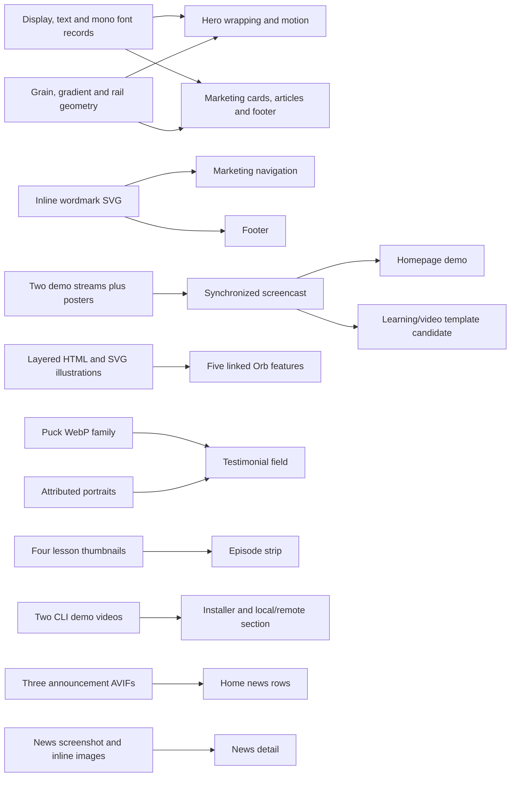

# Visual dependency map

Changing display fonts can alter every heading wrap and animated measurement layer. HOME-CSSOM-001 confirms font-face source mapping and swap declarations; actual requested subset/load status and reuse rights remain unresolved. Player, sidebar, and transcript states alter page height and downstream comparison scroll positions. Asset license/source approval must precede implementation use. This map records visual dependencies; it does not establish that the reference uses shared source components. Required sources and confidence are in asset-inventory.md.
