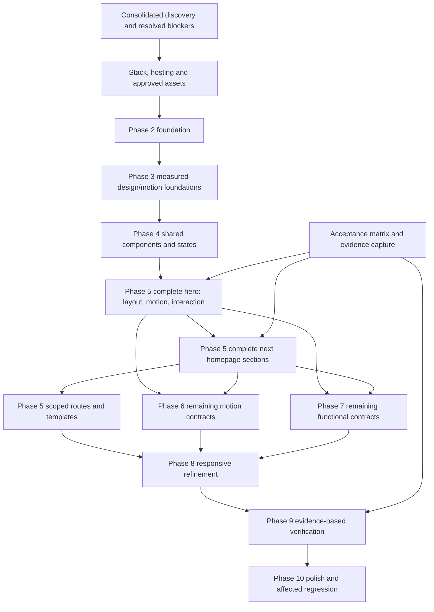

# Future implementation plan

**Planning only. Implementation has not started.** Phase 1 discovery remains limited by missing persisted screenshots/frame recordings, reduced-motion testing, asset downloads/rights, and unresolved motion/scroll mechanisms. See [unknowns.md](unknowns.md), [risk-register.md](risk-register.md) and [technical-decisions.md](technical-decisions.md). Relative complexity is a planning judgment, not a time estimate.

## Execution principle

Build measured foundations, then the complete hero's layout, motion and interactions, then each following section as a complete experience. The numbered motion/interaction/refinement phases below are workstreams and verification gates; they must not defer behavior that changes a section's geometry, wrapping, clipping, scroll or lifecycle. Proceed to scoped supporting pages and shared regression after the homepage contracts are reliable.

## Blocking prerequisites

- Agree an actual application stack/hosting policy; the initial folder contains no application.
- Resolve important asset/font provenance and approved sources or replacements.
- Recover persisted captures/recordings for high-risk visuals/motion, or explicitly accept and document the fidelity limit.
- Resolve exact title scheduler/full cycle and important scroll/lifecycle behavior. Approximately four-second insertion cadence, sampled entrance delays 280/340/400/460 ms, and exit 300 ms ease with 0/40/80/120 ms delays are already recorded; do not treat cadence as an exact configured timer.
- Test complete keyboard/overlay behavior and runtime activation of confirmed reduced-motion/hover/focus CSS alternatives; declarations are known, runtime scheduling remains incomplete.
- Use the final scoped route map; do not create unobserved marketing/pricing pages from a conventional naming pattern.

## Phase 2 — Foundation

- **Objective/tasks:** Establish the agreed project and routing plan; integrate measured design tokens and approved asset manifest; choose future test tooling and baseline conditions.
- **Dependencies/prerequisites:** Route/template scope, ADR-001, asset rights, browser support and hosting decisions.
- **Deliverables:** Running application foundation, route shells, token/asset/test foundations in the next independent task.
- **Acceptance:** Direct entry/refresh supported; tokens retain measured confidence; no guessed routes or media.
- **Risk:** Premature stack choice or wrong font metrics changes the entire reconstruction.
- **Verification:** Foundation smoke checks, route deep-link checks, computed-token inspection, font loading capture.
- **Relative complexity:** Medium, pending hosting/asset constraints.

## Phase 3 — Design system

- **Objective/tasks:** Integrate observed typography/color/spacing/layout/control foundations and reusable motion values. Encode confirmed grid transitions and fluid title behavior from actual measurements.
- **Dependencies/prerequisites:** Foundation; consolidated [design-system.md](design-system.md) and [responsive-spec.md](responsive-spec.md); declared face mapping from HOME-CSSOM-001 and authorized fonts. Actual loaded subsets/variable axes still need verification.
- **Deliverables:** Measured primitives and shared motion/accessibility policies.
- **Acceptance:** One/three/five-column changes at confirmed widths; exact declared title clamp, font metrics/wrapping and measured tokens match.
- **Risk:** Applying page-wide ratios to sections with different spans; replacing the confirmed fluid clamp with a formula derived only from samples.
- **Verification:** Required viewports and 767/768, 1023/1024 boundary captures; computed-token and wrap comparisons.
- **Relative complexity:** Medium.

## Phase 4 — Shared components

- **Objective/tasks:** Implement observed navigation, overlay, controls, footer and other actually repeated structures, with states and keyboard/touch behavior together.
- **Dependencies/prerequisites:** Foundations, [component-contracts.md](component-contracts.md), measured shared-state/dismissal contracts.
- **Deliverables:** Reusable composites and shared navigation relationships.
- **Acceptance:** Contract states and route outcomes pass; measured Escape/outside dismissal and Tab-to-Home ring reproduce; overlay behavior during resize/repeat actions follows the agreed contract, including explicit treatment of the reference's hidden-trigger/expanded=true state.
- **Risk:** Unverified focus trapping/dismissal; abstraction hides section-specific behavior.
- **Verification:** State tests, manual keyboard/touch sequence, shared-route regression.
- **Relative complexity:** Medium; overlay behavior can be high if evidence remains incomplete.

## Phase 5 — Page structures and complete section experiences

- **Objective/tasks:** Implement the hero's actual layout/title progression/media/control behavior; verify it; implement each subsequent homepage section with its animation/interactions; then scoped supporting routes and representative content templates.
- **Dependencies/prerequisites:** Page specs, approved media, title/media/installer contracts, foundation/shared components.
- **Deliverables:** Complete homepage and scoped page/template experiences, each with evidence-linked acceptance results.
- **Acceptance:** Section order and geometry match; no substitute animation patterns; important controls and final states pass at primary viewports.
- **Risk:** Title wrapping/clipping, synchronized media state, horizontal scrolling and installers have tight layout/behavior coupling.
- **Verification:** Section paired captures, intermediate motion frames, media synchronization/control tests, route/template comparisons.
- **Relative complexity:** High.

## Phase 6 — Motion system completion

- **Objective/tasks:** Complete remaining page-load, scroll, decorative and transition contracts; coordinate shared lifecycle; add observed or explicitly approved reduced-motion alternative.
- **Dependencies/prerequisites:** Per-section integrated behavior from Phase 5; resolved animation timelines/scroll questions; frame evidence.
- **Deliverables:** Complete measured motion inventory with responsive and interruption behavior.
- **Acceptance:** Recorded entrance origin/path/emphasis/560 ms easing/delays match; exits use center origin, 300 ms ease, sampled 0/40/80/120 ms stagger and 18 px upward path. Insertion cadence follows measured approximate behavior. Storm/Puck/track paths and declared alternatives match; exact scheduler/full cycle and runtime preference/re-entry still need tests.
- **Risk:** Final screenshot matches while trajectory/sequence differs; duplicate schedules after navigation.
- **Verification:** CSS configuration inspection plus time-sampled frames, resize/interruption/re-entry tests, and actual reduced-motion/hover/focus activation. CSS declarations alone do not pass runtime alternatives.
- **Relative complexity:** High.

## Phase 7 — Functional interaction completion

- **Objective/tasks:** Close all remaining menus, installer/platform/copy, carousel, media, navigation, history, keyboard/touch and route-state contracts.
- **Dependencies/prerequisites:** Existing per-section controls; [interaction-spec.md](interaction-spec.md); tested safe states and resolved gaps.
- **Deliverables:** Complete behavior matrix and one future test per important interaction.
- **Acceptance:** Every recorded transition/destination is testable and passes; rapid/repeated use and reversal do not corrupt state. Installer toast/icon feedback and exact clipboard command payload are separate assertions; current payload success is unresolved.
- **Risk:** Inventing loading/error/disabled behavior not observed; public/backend scope creep.
- **Verification:** State/action assertions, destination/history tests including observed `/docs`→`/docs/the-dial`→Back `/docs`, manual keyboard/touch review. Do not perform real purchases or registrations.
- **Relative complexity:** Medium to high.

## Phase 8 — Responsive refinement

- **Objective/tasks:** Refine all seven viewports, actual transition boundaries, title wraps, content ordering/cropping/overflow and responsive motion/input behavior.
- **Dependencies/prerequisites:** Complete page contracts and responsive evidence; real input/device support where required.
- **Deliverables:** Responsive comparison matrix and corrected states.
- **Acceptance:** Measured compositions at required samples/boundaries match; mobile menu/media/carousel/installer remain usable; no unintended horizontal document overflow.
- **Risk:** Desktop hover assumptions, menu open during resize, hidden/overlapping type or media.
- **Verification:** Viewport/boundary suite, touch-like actions and resize-during-state tests.
- **Relative complexity:** High.

## Phase 9 — Verification

- **Objective/tasks:** Run evidence-linked visual/motion/interaction/route/responsive/accessibility/regression suites; resolve discrepancies by contract priority.
- **Dependencies/prerequisites:** [verification-plan.md](verification-plan.md), [acceptance-criteria.md](acceptance-criteria.md), reliable captures, calibrated tolerances.
- **Deliverables:** Pass/fail matrix with difference images/frames/state logs, risks accepted or repaired.
- **Acceptance:** P0 critical cases pass; any residual limit has specific evidence, impact and owner rather than an informal “close enough.”
- **Risk:** Rasterization noise disguises structural issues; pooled screenshot score conceals critical local defects.
- **Verification:** Identical-condition comparisons and manual evaluation of every material structural/behavioral difference.
- **Relative complexity:** High.

## Phase 10 — Final product polish

- **Objective/tasks:** Resolve documented accessibility/performance/cross-browser/finishing discrepancies; recheck affected shared contracts after each correction.
- **Dependencies/prerequisites:** Phase 9 failures/risks; measured performance baseline and support policy.
- **Deliverables:** Final implementation evidence and handoff, with known limitations.
- **Acceptance:** Agreed fidelity/accessibility/performance criteria pass; no new route/viewport/state regressions.
- **Risk:** Global polish changes font/layout/motion behavior on completed pages.
- **Verification:** Dependency-based regression, supported browsers, loading/frame/performance checks with recorded conditions.
- **Relative complexity:** Medium to high, dependent on discrepancies.

## Dependency graph

Execution is deferred to the next independent implementation task. Current discovery must stop without creating application code.
