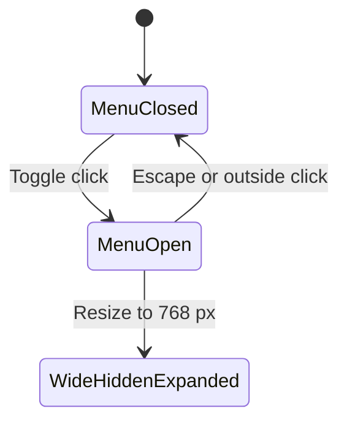
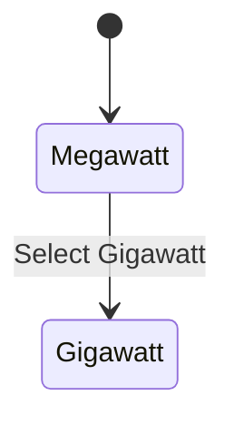
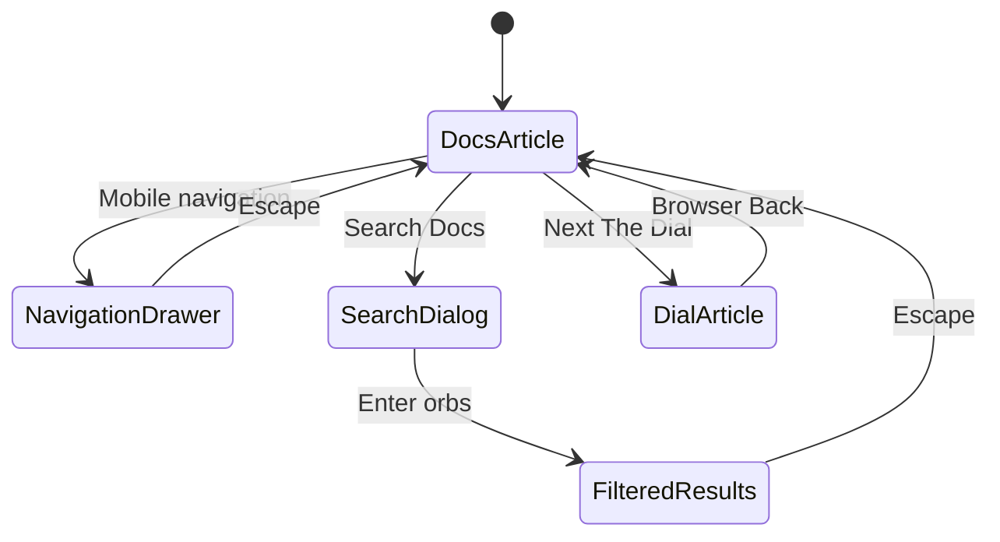
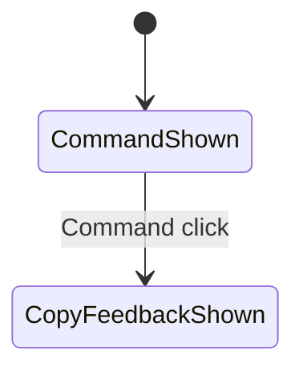

# Interaction state machines

These diagrams encode measured transitions and observed state sequences. Unknown reversals and follow-ups are stated in prose rather than drawn as verified transitions. Timing/accessibility limits are in [interaction-spec.md](interaction-spec.md); sources are in [evidence-index.md](evidence-index.md).

## Mobile marketing navigation

Repeated opening/closing was observed. Tab reached Home with a visible 1 px foreground ring. Resizing to 768 px hid the trigger while preserving aria-expanded=true. This is observed reference behavior, not a recommendation to retain an invisible expanded menu. Return-to-mobile behavior, full focus cycling/trapping, focus restoration and scroll lock remain unknown.

## Pricing tier and FAQ

Gigawatt-to-Megawatt reversal and keyboard tab behavior require follow-up. The measured change also updates the displayed price and CTA label.

```mermaid
stateDiagram-v2
  [*] --> FAQClosed
  FAQClosed --> FAQOne: Click first question
  FAQOne --> FAQTwo: Click second question; first closes
```

Closing the current question, rapid repeat, keyboard behavior and height-transition timing were not tested.

## Demo media and independent controls

```mermaid
stateDiagram-v2
  [*] --> InitialPaused
  InitialPaused --> PlayingNear16: Click chapter 0:16; both streams seek/play
  PlayingNear16 --> LaterPaused: Later observed state; cause UNKNOWN
```

The final arrow records a later observed state, not a verified automatic pause trigger. Both streams were sampled near 16.31 seconds after chapter activation. Selecting 1.5× changed both playback rates.

Playback, rate, captions, sidebar, transcript and chapters are independent state axes. Measured control transitions include:

| Axis | Measured transition |
|---|---|
| Rate | 1× → select 1.5× → both media playback rates 1.5 |
| Captions | aria-pressed=false → toggle → true; label becomes Hide Captions |
| Sidebar | aria-pressed=false → toggle → true; label becomes Hide Sidebar and grid changes |
| Mobile transcript | Collapsed → activate → expanded |
| Mobile chapters | aria-expanded=false → activate → true |

These transitions must not be incorrectly coupled in the implementation. Complete keyboard paths, reversal/end/loading/error states and media drift remain unresolved.

## Documentation drawer, search and history

The history test navigated from `/docs` to `/docs/the-dial` and back to `/docs`. Scroll position and the underlying client-navigation mechanism were not measured. Search selection, empty/error states and a complete focus-trap cycle remain unknown. The visible Ctrl+K hint is not proof that its shortcut was executed.

## Installer and episode track

Installer platform selection is a three-value state: Mac/Linux/WSL, Windows and Homebrew. Each maps to its recorded command in [interaction-spec.md](interaction-spec.md). Copy feedback is a separate state with later measured UI evidence; payload success remains unverified. Clicking a command did not execute it.
 
The earlier capture did not show durable copy feedback. Later INT-INSTALL-COPY-002 supersedes that limitation: Windows command click displayed a “Copied to clipboard” toast, a Dismiss control and an adjacent icon replacement. The clipboard-read tool returned earlier documentation content rather than the command; payload success is **UNKNOWN** and the tool/site mismatch cause is unresolved. No command was executed.

The arrow confirms UI feedback only. Dismiss activation, feedback lifetime/reset, repeated copy and error states remain untested; no arrow claims clipboard payload success.

Episode navigation changes a bounded scroll position rather than the route, until a card link is activated. Next moved scrollLeft from 0 to 327 px and enabled Previous. Exact reverse endpoint, final disabled rules, rapid repeat, wheel/drag/touch and key controls require follow-up.

Missing failure and rapid-transition states are tracked in [unknowns.md](unknowns.md).
