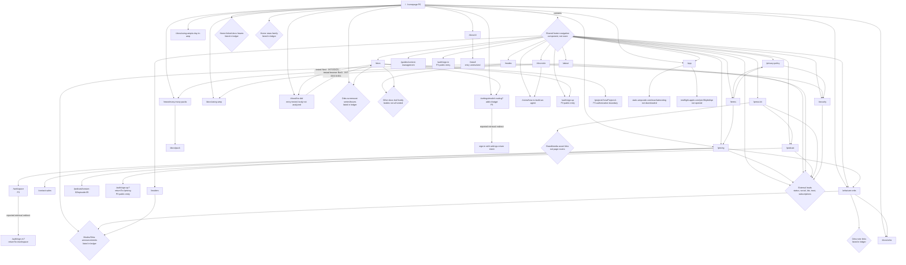

# Public navigation graph

Source date: 2026-10-09. Read alongside [website-map.md](website-map.md). Solid arrows below represent observed hrefs or web link-resolution results; successful browser transitions are asserted only for edges specifically marked tested. Dashed arrows represent page composition or family grouping. A group node is an inventory compression, not a URL. Explicit auth redirects and the tested Docs Next/Back route outcomes are labeled. Other history, new-tab policy, route transition, scroll landing and restoration behavior remains subject to [interaction-spec.md](interaction-spec.md).

Evidence: ROOT homepage/mobile-menu hrefs and [browser-template samples](page-specs/browser-template-samples.md); SUP supporting source/edge ledger; CONTENT representative-template records. Supporting source extraction does not establish navigation geometry, dropdowns or responsive menu structure.

## Exact edge ledger for grouped nodes

The page inventory supplies full origin URLs and scope statuses. Destinations below use root-relative paths; no route existence is inferred from naming patterns.

| Source | Destination group or exact destination | Evidence and caveat |
|---|---|---|
| Home sections | `/docs/using-amp/a-day-in-amp`, `/docs/orbs`, `/what-are-orbs`, `/docs/using-amp/screencasts/orbs`, `/docs/orbs/portals`, `/docs/orbs/event-driven`, `/docs/collaborate/multiplayer`, `/docs/the-dial`, `/docs/cli`, `/docs/cli/remote-control`, `/pricing` | ROOT observed href inventory; leaf bodies not all visited |
| Home Orbs feature links | `/docs/orbs#review-changes-and-browse-files`, `/docs/orbs#use-the-terminal` | ROOT hrefs preserve hashes; destination scroll outcome unverified here |
| Home tutorials | `/docs/using-amp/screencasts/orbs/get-started-in-orbs`, `/docs/using-amp/screencasts/orbs/portals-in-orbs`, `/docs/using-amp/screencasts/orbs/add-a-dev-sign-in`, `/docs/using-amp/screencasts/orbs/test-agent-friendliness` | ROOT hrefs; first/two episode content sampled by CONTENT |
| Home announcement group | `/news/many-many-pucks`, `/news/plaid-mode`, `/news/opus-5.5`, `/news/less-noise`, `/news/shared-runners`, `/news/the-mac-app-is-your-runner` | ROOT; Many Many Pucks has CONTENT representative |
| Mobile menu / About use link | `/docs/using-amp` | ROOT mobile-menu href; SUP resolved About link |
| Modes level records | `/news/the-dial` | WEB-MODES-001 resolved edges; four records converge |
| Modes Puck / voice records | `/news/meet-puck`, `/news/talk-to-puck` | WEB-MODES-001 resolved edges |
| Modes role records | `/docs/tools`, `/docs/models-and-subagents` | WEB-MODES-001 resolved edges; multiple role links converge |
| Orbs capability records | `/news/portals`, `/news/agents-in-orbs`, `/news/multiplayer`, `/news/schedule`, `/news/slack-integration`, `/news/event-driven-orbs`, `/news/from-agent-to-agent` | WEB-ORBS-001 resolved edges; text retrieval only |
| Orbs reading records | `/notes/putting-an-agent-in-an-orb`, `/notes/what-i-want-to-tell-you-about-orbs`, `/docs/orbs` | WEB-ORBS-001 resolved edges |
| Orbs section navigation | Same `/what-are-orbs` route | WEB-ORBS-001 resolved edges; web retrieval omitted fragment, so exact seven anchor hrefs await DOM census |
| News representative | `/docs/puck` | OBS-CONTENT-NEWS-001 |
| Learning breadcrumbs | `/docs`, `/chronicle`, `/docs/using-amp` | OBS-CONTENT-DAY-001 / OBS-CONTENT-SCREENCAST-001; actual scroll/history behavior unknown |
| Screencast first episode | `/docs/using-amp/screencasts/orbs/portals-in-orbs` | OBS-CONTENT-SCREENCAST-001; next-episode route resolved |
| Documentation onboarding | `/auth/sign-up`, `/settings/model-routing?add=chatgpt`, `/projects?newProject=1` | OBS-CONTENT-AUTH-001; auth/project boundaries excluded |
| Docs Next / browser Back | `/docs` → `/docs/the-dial` → `/docs` | INT-DOCS-001; browser navigation and return verified at 390 px; The Dial body not analyzed; precise scroll restoration unknown |
| CLI workspace-install lead | `/install` | OBS-CONTENT-DOCS-CLI-001; fetch failure is not site error evidence |
| Podcast latest episode | `/podcast/season-02/episode-05` | WEB-PODCAST-001 resolved edge; endpoint retrieved, player not tested |
| Insiders capacity notice | `/news/amp-free-is-full-for-now` | WEB-INSIDERS-001 resolved edge; application control destination remains UNKNOWN |
| Shared footer on sampled supporting/articles | `/app`, `/auth/sign-up`, `/auth/sign-in`, `/docs`, `/what-are-orbs`, `/modes`, `/about`, `/chronicle`, `/pricing`, `/podcast`, `/press-kit`, `/notes/how-to-build-an-agent`, `/guides/context-management`, `/insiders`, `/security`, `/privacy-policy`, `/terms`; external status/X/YouTube | SUP/CONTENT source text and selected edge resolutions; footer code reuse and visual arrangement unconfirmed here |

## Boundary behavior

Pricing Sign Up/Get Megawatt links resolve to sign-up with pricing return intent. Create a Workspace resolves `/workspace`, then retrieval reports sign-in with workspace return intent. Settings with `add=chatgpt` similarly reports a sign-in redirect retaining encoded return parameters. Project creation stopped at an authorization boundary. These are the only redirect outcomes asserted here; no successful account/workspace/project action occurred.

The `/app` DOM hrefs supplied by root point to macOS DMG and Apple TestFlight. Public app-page rendering was sampled at desktop/mobile sizes, resolving the earlier web-fetch limitation; the download destinations were not clicked. Press-kit SVG links are asset URLs; public availability is not a license grant. External media/link retrieval failures are recorded as limitations, not as website error states.

## Graph gaps and future verification

Exact exhaustive Chronicle/docs href inventory, the seven Orb anchor targets, Insiders application destination, external-social/media destinations, public install-entry classification, player transitions and link target/new-tab policies remain incomplete. Docs Next and Back are tested; other route transitions, query/hash landing, authentication entry, errors, Forward and precise scroll restoration require verification before declaring route fidelity. No unseen route or authenticated product behavior is specified.
